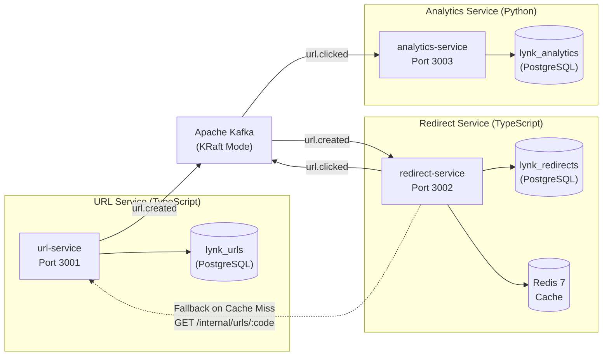
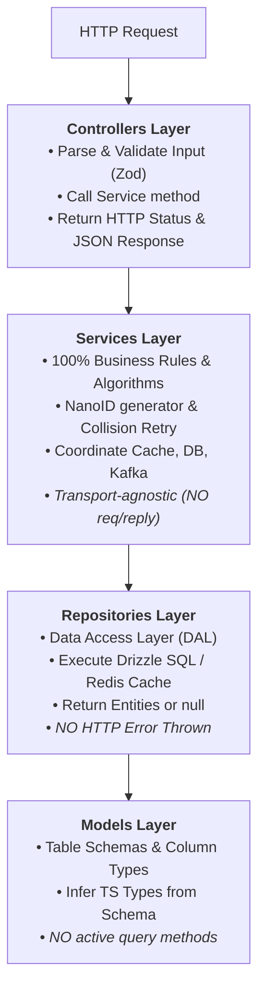

# 🤖 AGENT.md — Engineering Charter & Guidelines for AI Assistants

> **Tài liệu hướng dẫn bắt buộc dành cho mọi AI Agent (Antigravity, Claude, Cursor, Copilot,...) khi đọc, sửa đổi hoặc sinh mã nguồn trong dự án Lynk.**
> Mọi đoạn code, cấu trúc thư mục, kiến trúc phân tầng và quyết định kỹ thuật phải tuân thủ nghiêm ngặt các quy tắc trong tài liệu này.

---

## 🎯 1. Triết lý dự án & Định vị mục tiêu

- **Tên dự án:** Lynk — Production-Grade Distributed URL Shortener.
- **Mục tiêu:** Flagship Portfolio Project ứng tuyển vị trí **Software Engineer / Backend / DevOps Intern**.
- **Phương châm cốt lõi:** **"Build ➔ Deploy ➔ Measure ➔ Explain"**.
- **Nguyên tắc kỹ thuật:**
  1. **Evidence-based Architecture:** Mỗi quyết định kiến trúc (thêm Redis, Kafka, K8s,...) phải xuất phát từ bài toán thực tế và có số liệu thực nghiệm (benchmark/resilience test) để chứng minh.
  2. **Tránh Overengineering vô căn cứ:** Không tự ý đưa công nghệ mới (như ClickHouse, gRPC, Service Mesh) vào mã nguồn nếu chưa có kế hoạch hoặc chưa có benchmark chứng minh sự cần thiết.
  3. **Không tạo số liệu giả:** Mọi chỉ số hiệu năng (latency, throughput, cache hit ratio, error rate) phải là số liệu đo lường thực tế từ k6/Grafana, không tự viết số giả định vào tài liệu.

---

## 🏛️ 2. Bounded Contexts & Quyền sở hữu dữ liệu (Data Ownership)

Hệ thống Lynk là một hệ thống phân tán đa ngôn ngữ (Polyglot Microservices). AI **tuyệt đối không** được phá vỡ ranh giới dữ liệu giữa các dịch vụ:



| Dịch vụ                 | Ngôn ngữ / Framework  | Cơ sở dữ liệu sở hữu                        | Trách nhiệm chính & Ranh giới                                                                                                                                                                                   |
| :---------------------- | :-------------------- | :------------------------------------------ | :-------------------------------------------------------------------------------------------------------------------------------------------------------------------------------------------------------------- |
| **`url-service`**       | TypeScript / Fastify  | `lynk_urls` (PostgreSQL)                    | **Write Model:** Quản lý vòng đời URL (tạo, validate, custom alias, TTL, metadata). Phát event `url.created`.                                                                                                   |
| **`redirect-service`**  | TypeScript / Fastify  | `lynk_redirects` (PostgreSQL) + **Redis 7** | **Read Model:** Chuyển hướng 302 tốc độ cao, tiêu thụ `url.created` nạp vào cache + local replica. Phát event `url.clicked` kèm OpenTelemetry trace context. Có fallback HTTP sang `url-service` khi cold-miss. |
| **`analytics-service`** | Python 3.12 / FastAPI | `lynk_analytics` (PostgreSQL)               | **Analytics Model:** Tiêu thụ event `url.clicked` từ Kafka, phân tích User-Agent, lưu trữ raw clicks và bảng thống kê tổng hợp (daily rollups). Cung cấp API truy vấn analytics.                                |

> ⚠️ **ĐIỀU CẤM KỴ:** `redirect-service` và `analytics-service` **không bao giờ** được truy vấn trực tiếp vào database `lynk_urls` của `url-service`. Mọi sự trao đổi dữ liệu bắt buộc thông qua Kafka Events hoặc internal API có kiểm soát.

---

## 📂 3. Cấu trúc thư mục chuẩn Layer-Based cho Microservice

Mỗi microservice (TypeScript Fastify hoặc Python FastAPI) **bắt buộc** phải tổ chức mã nguồn theo mô hình 4 tầng (Layer-Based Architecture):

$$\mathbf{routes/} \longrightarrow \mathbf{controllers/} \longrightarrow \mathbf{services/} \longrightarrow \mathbf{repositories/} \longrightarrow \mathbf{models/}$$

### 3.1. Cấu trúc thư mục mẫu (`services/<service-name>/src/`)

```text
services/<service-name>/
├── src/
│   ├── routes/              # Khai báo URL paths & route registration với Fastify
│   │   └── url.routes.ts
│   │
│   ├── controllers/         # Tầng tiếp nhận HTTP Request & Response
│   │   └── url.controller.ts
│   │
│   ├── services/            # Tầng Nghiệp vụ cốt lõi (Business Logic Layer)
│   │   └── url.service.ts
│   │
│   ├── repositories/        # Tầng Truy xuất dữ liệu (Data Access Layer - DAL)
│   │   └── url.repository.ts
│   │
│   ├── models/              # Tầng Schema Database (Drizzle ORM / SQLAlchemy)
│   │   └── url.model.ts
│   │
│   ├── schemas/             # Tầng DTO & Input/Output Validation (Zod / Pydantic)
│   │   └── url.schema.ts
│   │
│   ├── config/              # Biến môi trường & cấu hình hệ thống
│   │   └── env.ts
│   │
│   ├── infra/               # Khởi tạo kết nối hạ tầng (DB pool, Redis client, Kafka producer/consumer)
│   │   ├── db.ts
│   │   ├── redis.ts
│   │   └── kafka.ts
│   │
│   ├── errors/              # Custom Domain Errors & HTTP status code mapping
│   │   └── app-error.ts
│   │
│   ├── app.ts               # Fastify Application Factory (buildApp)
│   └── server.ts            # Process Entrypoint & Graceful Shutdown
│
├── tests/
│   ├── unit/                # Unit tests cho Service, Utility, Generator (mock repo)
│   └── integration/         # API integration tests (app.inject() hoặc container)
├── Dockerfile               # Multi-stage non-root build
├── package.json
└── tsconfig.json
```

### 3.2. Hợp đồng trách nhiệm giữa các tầng (Layer Contracts & Rules)



#### Quy tắc nghiêm ngặt:

1. **`controllers/`:**
   - **Được làm:** Đọc `request.body`, `request.params`, `request.query`; gọi parse validation qua Zod schema; gọi method của Service; gửi `reply.status(code).send(data)`.
   - **Cấm:** Không viết thuật toán sinh mã, không viết câu lệnh SQL/ORM, không tương tác Redis hay Kafka, không nhét business logic vào controller.
2. **`services/`:**
   - **Được làm:** Xử lý nghiệp vụ thuần túy (kiểm tra hạn link, sinh mã ngẫu nhiên NanoID, retry khi trùng mã, nạp cache Redis, gọi Kafka producer).
   - **Cấm:** Không bao giờ nhận hoặc phụ thuộc vào object `FastifyRequest` hay `FastifyReply`. Không trả về HTTP status code (chỉ ném Domain Error).
3. **`repositories/`:**
   - **Được làm:** Thực thi các thao tác đọc/ghi vào Database (Drizzle ORM) hoặc Cache (Redis). Trả về Entity hoặc `null`/`undefined`.
   - **Cấm:** Không ném lỗi HTTP (như 404, 400). Không chứa logic nghiệp vụ (không tự quyết định link có hết hạn hay không).
4. **`models/`:**
   - **Được làm:** Định nghĩa bảng Drizzle (`pgTable`), kiểu dữ liệu các cột, khóa ngoại, indexes. Export TypeScript Types.
   - **Cấm:** Không viết các hàm truy vấn trong model (tránh Active Record pattern).

---

## 💻 4. Quy chuẩn viết code (Coding Standards)

### 4.1. TypeScript (Node.js v24 ESM)

- **Bắt buộc đuôi `.js` trong imports:** Do dự án dùng NodeNext module resolution, mọi import local file phải có đuôi `.js`:
  ```typescript
  // ✅ ĐÚNG:
  import { buildApp } from './app.js';
  import { urlService } from './services/url.service.js';
  import { loadEnv } from './config/env.js';

  // ❌ SAI (sẽ gây lỗi compile runtime):
  import { buildApp } from './app';
  import { urlService } from './services/url.service';
  ```
- **App Factory Pattern:** Luôn tách `app.ts` (hàm `buildApp(env)`) khỏi `server.ts`. Điều này cho phép test suite dùng `app.inject()` kiểm thử API siêu nhanh mà không phải bind cổng mạng TCP thật.
- **Type-Safe Configuration:** Sử dụng Zod để validate $100\%$ biến môi trường trong `src/config/env.ts` trước khi ứng dụng khởi động.
- **Structured Logging với Pino:**
  ```typescript
  // ✅ ĐÚNG:
  app.log.info({ shortCode, originalUrl }, 'Short URL created successfully');

  // ❌ SAI:
  console.log(`Created URL: ${shortCode}`);
  ```
- **Error Handling thống nhất:** Tạo custom error class kế thừa từ `AppError` và xử lý tập trung qua Fastify `setErrorHandler`:
  ```typescript
  export class AppError extends Error {
    constructor(
      public readonly statusCode: number,
      public readonly code: string,
      message: string,
      public readonly details?: unknown,
    ) {
      super(message);
      this.name = this.constructor.name;
    }
  }

  export class NotFoundError extends AppError {
    constructor(message = 'Resource not found') {
      super(404, 'NOT_FOUND', message);
    }
  }
  ```

### 4.2. Python (Analytics Service)

- **Python Version:** 3.12+.
- **Web Framework:** FastAPI với async routes (`async def`).
- **Validation:** Pydantic v2 schemas (`BaseModel`).
- **Database Access:** SQLAlchemy 2.0 (async engine) + Alembic migrations.
- **Kafka Consumer:** `aiokafka` chạy trong async background worker task.
- **Linter & Formatter:** Sử dụng **Ruff** (`ruff check .`, `ruff format .`).
- **Logging:** Dùng `structlog` hoặc standard logging xuất JSON structured logs.

---

## 🗄️ 5. Quy tắc Database & Migration

1. **Expand / Contract Pattern:** Mọi thay đổi schema database phải tương thích ngược (backward-compatible) với các Pods cũ đang chạy trong quá trình Rolling Update của Kubernetes:
   - _Bước 1 (Expand):_ Thêm cột mới nullable hoặc có giá trị mặc định. Deploy code mới.
   - _Bước 2 (Contract):_ Sau khi mọi Pod đã chạy code mới, mới tạo migration dọn dẹp các cột cũ.
2. **K8s Migration Job:**
   - **Cấm:** Không bao giờ chạy migration trực tiếp từ InitContainer của Pod ứng dụng (gây race condition khi scale nhiều replicas).
   - **Bắt buộc:** Chạy migration thông qua **Kubernetes Job** độc lập trong pipeline CI/CD trước khi triển khai Pods ứng dụng mới.

---

## 🐳 6. Hạ tầng, Docker & Bảo mật

1. **Multi-Stage Dockerfile:** Mọi service phải có Dockerfile multi-stage tách biệt stage `builder` (chứa dev dependencies, TypeScript compiler) và stage `runner` (chỉ chứa production artifacts).
2. **Bảo mật Non-Root:** Container **bắt buộc** phải chạy dưới unprivileged user:
   ```dockerfile
   # Trong Node.js alpine:
   USER node

   # Trong Python alpine:
   RUN adduser -D -u 1000 appuser
   USER appuser
   ```
3. **Kafka KRaft Mode:** Sử dụng Apache Kafka trong **KRaft mode (không dùng Zookeeper)** để tiết kiệm $50\%$ RAM và đơn giản hóa kiến trúc.
4. **Không commit Secrets:** Không bao giờ commit `.env`, token, mật khẩu vào Git repository. Dùng Kubernetes Secrets hoặc ConfigMaps.

---

## 🛠️ 7. Quy trình làm việc & Lệnh điều hành (Developer Workflow)

### 7.1. Bảng lệnh `make` tiêu chuẩn

| Lệnh                    | Mô tả hành động                                                |
| :---------------------- | :------------------------------------------------------------- |
| `make setup`            | Cài đặt toàn bộ npm workspaces dependencies.                   |
| `make build`            | Compile TypeScript toàn bộ workspaces.                         |
| `make test`             | Chạy toàn bộ test suites (Vitest).                             |
| `make lint`             | Chạy linter (ESLint flat config) kiểm tra chất lượng code.     |
| `make format`           | Tự động format code với Prettier.                              |
| `make docker-build-url` | Build local Docker image cho `url-service`.                    |
| `make k8s-up`           | Khởi chạy cụm Kubernetes `kind` kèm Traefik Ingress và ArgoCD. |
| `make k8s-down`         | Xóa cụm Kubernetes `kind`.                                     |

### 7.2. Chuẩn Git Commit (Conventional Commits)

Mọi commit phải tuân thủ định dạng: `<type>(<scope>): <short description>`

- `feat`: Thêm tính năng mới (ví dụ: `feat(url-service): add custom alias support`).
- `fix`: Sửa lỗi (ví dụ: `fix(redirect-service): fix redis cache expiration sync`).
- `chore`: Cập nhật cấu hình, dependency, GitOps (ví dụ: `chore(deps): update fastify to v5.2`).
- `docs`: Cập nhật tài liệu, ADRs, README (ví dụ: `docs(adr): add ADR-001 short code strategy`).
- `test`: Thêm hoặc sửa test cases (ví dụ: `test(url-service): add collision retry unit test`).

---

## ✅ 8. Checklist kiểm tra của AI trước khi bàn giao (Pre-flight Checklist)

Trước khi thông báo hoàn thành bất kỳ task nào, AI Agent **phải tự động kiểm tra**:

- [ ] Code tuân thủ kiến trúc Layer-based: `controllers ➔ services ➔ repositories ➔ models`.
- [ ] Imports trong TypeScript sử dụng đúng đuôi `.js`.
- [ ] Service layer không dính líu đến `FastifyRequest` hay `FastifyReply`.
- [ ] Không có `console.log` trong service code (dùng `app.log` của Pino).
- [ ] Các endpoint có liveness/readiness probes hoạt động chính xác.
- [ ] Đã chạy `npm run lint` và `npm run test` với kết quả $100\%$ pass.
- [ ] Dockerfile cấu hình non-root user (`USER node`).
