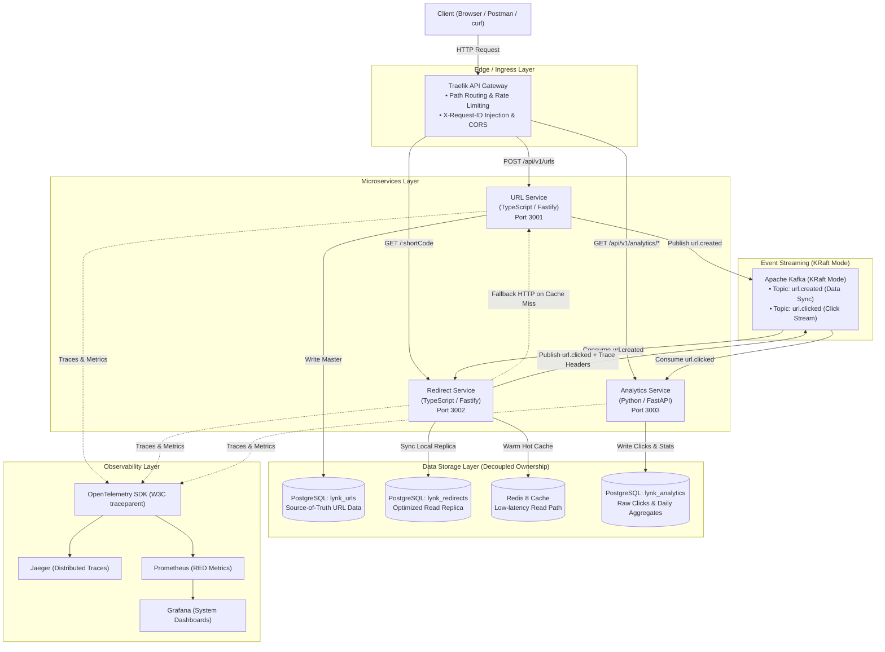

# 🔗 Lynk — Production-Grade Distributed URL Shortener

[](https://github.com/ngqkhai/lynk-url-shortener/actions/workflows/ci.yml)
[](LICENSE)
[](https://kubernetes.io/)
[](https://argo-cd.readthedocs.io/)
[](https://traefik.io/)

> **Lynk** là một hệ thống rút gọn liên kết (URL Shortener) phân tán chuẩn Production, được thiết kế theo phương pháp **"Build ➔ Deploy ➔ Measure ➔ Explain"** nhằm phục vụ mục tiêu portfolio cho các vị trí **Software Engineer / Backend / DevOps Intern**.

---

## 🏛️ Kiến trúc hệ thống tổng thể (System Architecture)



---

## 🚀 Tính năng nổi bật & Công nghệ sử dụng

| Lĩnh vực                   | Công nghệ                                       | Mục đích sử dụng                                                          |
| :------------------------- | :---------------------------------------------- | :------------------------------------------------------------------------ |
| **Backend & Polyglot**     | TypeScript, Fastify, Python 3.12, FastAPI       | URL CRUD, High-performance redirect, Analytics processing.                |
| **Data & Caching**         | PostgreSQL 16, Redis 8, Drizzle ORM, SQLAlchemy | Lưu trữ bền vững, Hybrid caching, Schema migrations.                      |
| **Event Streaming**        | Apache Kafka (KRaft mode)                       | Xử lý click stream bất đồng bộ và đồng bộ dữ liệu giữa các services.      |
| **Edge & Ingress**         | Traefik v3                                      | Reverse proxy, Ingress Controller, Rate limiting, Request ID propagation. |
| **Observability**          | OpenTelemetry, Prometheus, Grafana, Jaeger      | RED metrics, Distributed tracing xuyên qua HTTP & Kafka headers.          |
| **Orchestration & GitOps** | Docker, Kubernetes (`kind`), Helm, ArgoCD       | Tự động hóa triển khai, declarative infrastructure, self-healing.         |
| **CI/CD**                  | GitHub Actions, GHCR (`ghcr.io`)                | Lint, Unit/Integration tests, multi-stage Docker build, image scanning.   |

---

## ⚡ Khởi động nhanh (Quickstart)

```bash
# 1. Cài đặt dependencies và kiểm tra code
make setup
make lint
make test

# 2. Deploy working tree hiện tại vào kind (PostgreSQL + Redis trong cluster)
make k8s-local-deploy

# 3. Kiểm tra readiness qua Ingress
curl -i --resolve lynk.localhost:80:127.0.0.1 http://lynk.localhost/health/ready
```

Chi tiết hướng dẫn xem tại: [Local Setup Runbook](docs/runbook/local-setup.md).

---

## 🗺️ Lộ trình phát triển 6 Sprints

- [x] **Sprint 0: Foundation & Walking Skeleton** — Monorepo, Fastify Skeleton, K8s (`kind`), Traefik, ArgoCD, Day-1 CI/CD.
- [x] **Sprint 1: Core URL Shortening Capability** — NanoID base62, PostgreSQL, Drizzle ORM, 302 redirect, TTL handling.
- [ ] **Sprint 2: High-Performance Redirect Path** — Redis cache-aside, tách `redirect-service`, k6 caching benchmark; chờ số liệu staging.
- [ ] **Sprint 3: Non-Blocking Event-Driven Analytics** — Kafka KRaft, `analytics-service` (Python), async click tracking.
- [ ] **Sprint 4: End-to-End Observability** — Prometheus RED metrics, Grafana dashboards, OpenTelemetry + Jaeger tracing.
- [ ] **Sprint 5: Production Hardening & Portfolio** — Rate limiting, Trivy security scan, backup scripts, hoàn thiện 8 ADRs.

---

## 📜 Tài liệu kỹ thuật & ADRs (Architecture Decision Records)

- [ADR-000: Walking Skeleton & Day-1 Continuous Delivery](docs/adr/000-walking-skeleton-and-ci-cd.md)
- [ADR-001: NanoID Base62 Short Code Strategy](docs/adr/001-short-code-strategy.md)
- [ADR-002: 302 Redirect Status Code](docs/adr/002-redirect-status-code.md)
- [ADR-003: Redis Cache-Aside](docs/adr/003-redis-cache-aside.md)
- [ADR-004: Redirect Service Decomposition](docs/adr/004-redirect-service-decomposition.md)
- [Experiment 01: Caching Benchmark](docs/experiments/01-caching.md)
- [Runbook: Local Development Setup](docs/runbook/local-setup.md)
- [Master Engineering Plan](docs/lynk-project-plan.md)
