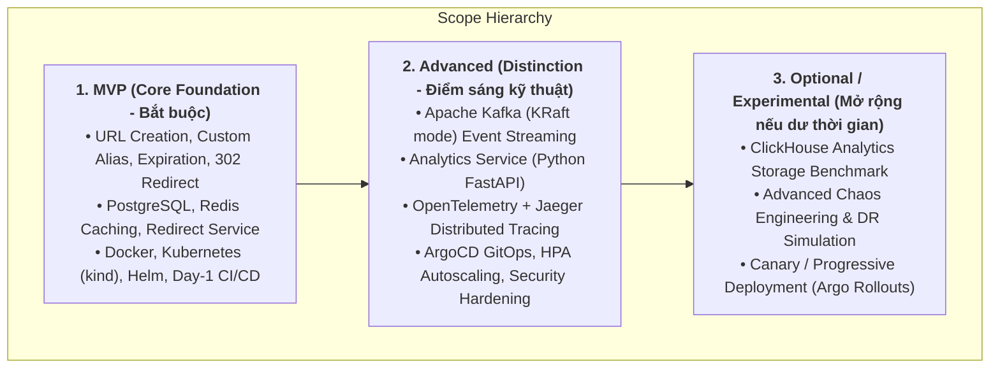
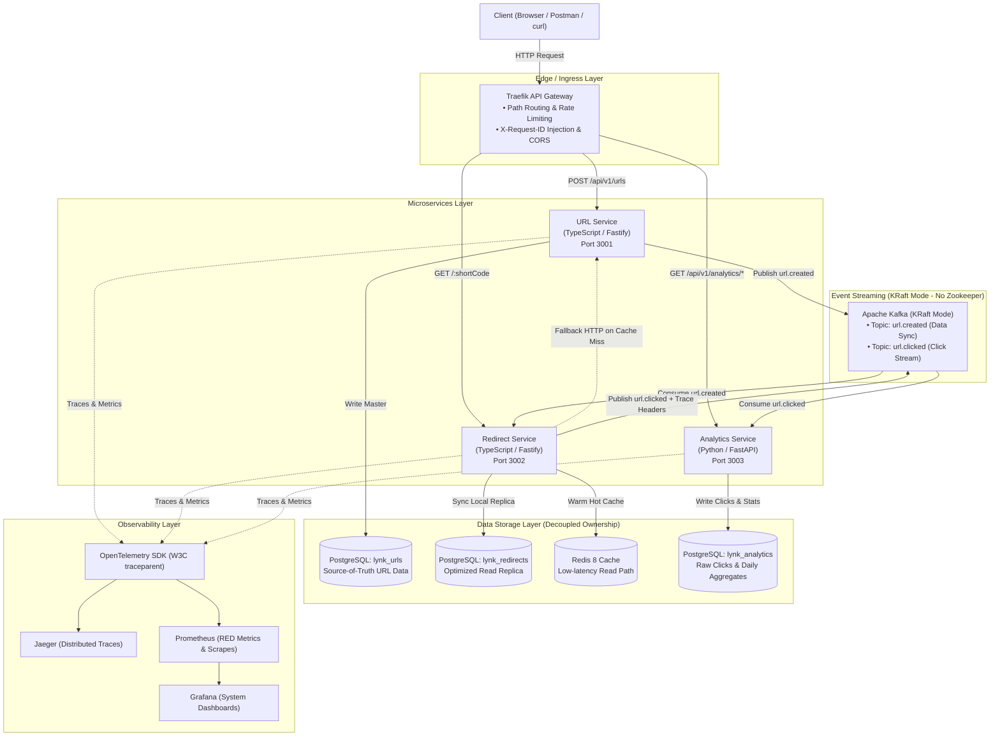
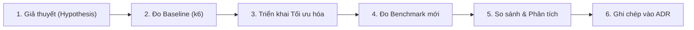
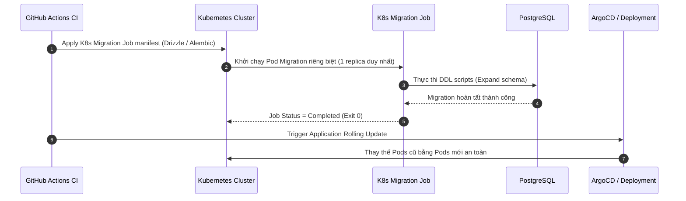
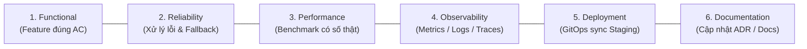

# Lynk URL Shortener — Master Engineering Plan (Solo Developer Edition)

> **Mục tiêu dự án:** Flagship Portfolio Project ứng tuyển vị trí **Software Engineer / Backend / DevOps Intern**.  
> **Phương pháp tiếp cận:** **"Build ➔ Deploy ➔ Measure ➔ Explain"**.  
> **Nguyên tắc kỹ thuật:** Mỗi quyết định kiến trúc phải xuất phát từ bài toán thực tế, được kiểm chứng bằng số liệu benchmark/thực nghiệm, và giải thích được rõ ràng các trade-offs.

---

## 🧭 1. Khung phát triển dành cho Solo Developer

Dự án được thực hiện bởi **1 Solo Developer**, nhưng áp dụng kỷ luật kỹ thuật chuyên nghiệp thông qua việc mô phỏng các vai trò (Engineering Disciplines) theo chu kỳ **Scrum 2 tuần (6 Sprints = 12 tuần)** kết hợp văn hóa **DevOps / Continuous Delivery**.

### 1.1. Ma trận trách nhiệm (Solo Engineering Matrix)

Thay vì giả định một team đông người, solo developer luân phiên đảm nhiệm các góc nhìn kỹ thuật trong từng giai đoạn:

| Lĩnh vực kỹ thuật          | Trách nhiệm của Solo Developer trong dự án                                                                       |
| :------------------------- | :--------------------------------------------------------------------------------------------------------------- |
| **Product & Architecture** | Viết User Stories (Gherkin format), định nghĩa Acceptance Criteria, viết ADRs giải thích trade-offs.             |
| **Backend Engineering**    | Xây dựng core business logic (TypeScript Fastify, Python FastAPI), data modeling, unit/integration tests.        |
| **DevOps & Platform**      | Xây dựng Day-1 CI/CD (GitHub Actions), Docker multi-stage, Kubernetes (`kind`), Helm, GitOps (ArgoCD).           |
| **QA & Reliability**       | Thiết kế k6 benchmark scripts, failure injection testing, kiểm thử zero-downtime rolling updates.                |
| **Security & SRE**         | Quét lỗ hổng container (Trivy), cấu hình non-root users, rate limiting, Prometheus metrics & Grafana dashboards. |

### 1.2. Phân tầng phạm vi dự án (Scope Tiering)

Để đảm bảo dự án luôn có sản phẩm hoàn chỉnh dù thời gian bị hạn chế, toàn bộ hệ thống được chia thành 3 tầng:



### 1.3. Definition of Done (DoD) thực tế

Một User Story / Task chỉ được coi là hoàn thành (Done) khi thỏa mãn:

1. **Functional:** Logic nghiệp vụ hoạt động đúng theo Acceptance Criteria.
2. **Testing:** Logic cốt lõi (Core business logic) có Unit Tests; các luồng API chính có Integration Tests với container thật.
3. **Quality & Security:** Linting/Typecheck pass $100\%$; quét container image bằng **Trivy** không có lỗi bảo mật nghiêm trọng (Critical CVEs); container chạy dưới non-root user.
4. **Documentation:** OpenAPI/Swagger docs được cập nhật; quyết định kiến trúc quan trọng được ghi nhận vào `docs/adr/`.
5. **Continuous Delivery:** Pull Request tự động vượt qua CI check, image được đẩy lên GitHub Container Registry (`ghcr.io`), và deploy thành công lên staging Kubernetes.

---

## 🏗️ 2. Kiến trúc tổng thể & Ranh giới dữ liệu (Data Ownership)



### 2.1. Phân định Data Ownership rõ ràng

| Service               | Bounded Context                                | Data Ownership                                  | Lý do thiết kế                                                                                                                                   |
| :-------------------- | :--------------------------------------------- | :---------------------------------------------- | :----------------------------------------------------------------------------------------------------------------------------------------------- |
| **URL Service**       | Quản lý vòng đời URL (Write Model)             | `lynk_urls` (PostgreSQL)                        | Đảm bảo tính toàn vẹn (ACID), kiểm tra trùng lặp custom alias, quản lý metadata và ngày hết hạn.                                                 |
| **Redirect Service**  | Xử lý chuyển hướng tốc độ cao (Read Model)     | `lynk_redirects` (PostgreSQL) + **Redis Cache** | Tách riêng read path để scale độc lập; Redis phục vụ $95\%+$ traffic; local DB làm fallback mà không phụ thuộc trực tiếp vào DB của URL Service. |
| **Analytics Service** | Thu thập và tổng hợp số liệu (Analytics Model) | `lynk_analytics` (PostgreSQL)                   | Lưu trữ raw click stream và thống kê tổng hợp; tách biệt hoàn toàn để tác vụ phân tích nặng không ảnh hưởng đến luồng redirect.                  |

> [!NOTE]
> **Cơ chế đồng bộ dữ liệu:** Khi tạo URL mới, `URL Service` phát event `url.created` vào Kafka. `Redirect Service` tiêu thụ event này để ghi vào DB cục bộ và nạp trước vào Redis. Trong trường hợp xảy ra cold-miss (click ngay khi Kafka chưa kịp sync), `Redirect Service` có fallback gọi internal HTTP `GET /internal/urls/:code` sang `URL Service` trước khi trả 404.

---

## 🔬 3. Chuỗi thực nghiệm kỹ thuật (Engineering Experiments Track)

> Đây là phần trọng tâm giúp chứng minh tư duy kỹ thuật: **Không quyết định kiến trúc bằng cảm tính, mà bằng đo lường thực tế.**



### 🧪 Experiment A — Hiệu năng Caching (PostgreSQL-only vs Redis + PostgreSQL)

- **Câu hỏi kỹ thuật:** Việc bổ sung Redis Cache vào luồng redirect cải thiện độ trễ và thông lượng như thế nào so với việc chỉ đọc từ PostgreSQL có index?
- **Phương pháp đo:** Dùng `k6` gửi $100 \rightarrow 1,000\text{ RPS}$ vào endpoint `GET /:shortCode`.
- **Chỉ số đo lường:** Latency ($p50, p95, p99$), Throughput (RPS), CPU/Memory utilization, Cache Hit/Miss ratio.
- **Mẫu bảng kết quả ghi nhận trong README:**

| Cấu hình                            | Target RPS |   Actual RPS   |  Latency p50   |  Latency p95   |  Latency p99   |   Error Rate   | CPU App | Mem App |
| :---------------------------------- | :--------: | :------------: | :------------: | :------------: | :------------: | :------------: | :-----: | :-----: |
| **PostgreSQL-only (No Cache)**      |    500     | _[Đo thực tế]_ | _[Đo thực tế]_ | _[Đo thực tế]_ | _[Đo thực tế]_ | _[Đo thực tế]_ |  _[%]_  | _[MB]_  |
| **Redis + PostgreSQL (Warm Cache)** |    500     | _[Đo thực tế]_ | _[Đo thực tế]_ | _[Đo thực tế]_ | _[Đo thực tế]_ | _[Đo thực tế]_ |  _[%]_  | _[MB]_  |

---

### 🧪 Experiment B — Tách biệt tải bằng Asynchronous Analytics (Sync vs Kafka Streaming)

- **Câu hỏi kỹ thuật:** Xử lý click analytics đồng bộ (Synchronous write DB trong luồng redirect) ảnh hưởng ra sao đến redirect latency so với việc đẩy event bất đồng bộ qua Kafka?
- **Phương pháp đo:** Giả lập Analytics DB bị chậm (thêm latency $50\text{ms}$ khi insert click). So sánh 2 kịch bản:
  1. _Kịch bản 1 (Sync):_ Redirect Service gọi trực tiếp Analytics DB trước khi trả 302.
  2. _Kịch bản 2 (Async via Kafka):_ Redirect Service chỉ bắn event vào Kafka topic rồi trả 302 ngay lập tức.
- **Chỉ số đo lường:** Redirect p99 latency, Throughput, Tỷ lệ lỗi khi Analytics DB bị nghẽn hoặc sập hoàn toàn.

---

### 🧪 Experiment C — Khả năng mở rộng ngang (Horizontal Scaling & HPA)

- **Câu hỏi kỹ thuật:** Khi tăng số lượng Pods của `redirect-service` (1 Pod vs 2 Pods vs 4 Pods), throughput của hệ thống tăng tuyến tính hay bị bottleneck ở đâu (Traefik Gateway hay Redis)?
- **Phương pháp đo:** Tăng dần tải bằng `k6` từ $500 \rightarrow 3,000\text{ RPS}$ trên Kubernetes `kind` cluster.
- **Chỉ số đo lường:** Max Sustainable Throughput (RPS tại p99 < ngưỡng chấp nhận), CPU/Memory từng Pod, Thời gian HPA kích hoạt scale-up.

---

### 🧪 Experiment D — Khả năng chịu lỗi & Phục hồi (Failure & Resilience Testing)

- **Câu hỏi kỹ thuật:** Hệ thống phản ứng thế nào khi các thành phần phụ thuộc gặp sự cố (Graceful Degradation)?
- **Các kịch bản kiểm thử:**
  1. **Redis bị Crash:** Redirect Service có tự động fallback về đọc PostgreSQL an toàn không? Độ trễ tăng lên bao nhiêu?
  2. **Kafka bị Down:** Redirect Service có tiếp tục redirect bình thường không? (Không được làm chết luồng chính, ghi log warning / circuit breaker).
  3. **Redirect Pod bị Kill đột ngột (`kubectl delete pod`):** Traefik và Kubernetes xử lý điều hướng sang Pod còn lại mất bao lâu? Có bao nhiêu request bị lỗi (downtime window)?
  4. **PostgreSQL bị Slow:** Redirect Service với hot cache có tiếp tục phục vụ được $95\%+$ request mà không bị ảnh hưởng không?

---

### 🧪 Optional Experiment E — Phân tích dữ liệu lớn: PostgreSQL vs ClickHouse

- **Điều kiện thực hiện:** Chỉ triển khai sau khi MVP và Kafka pipeline đã hoàn toàn ổn định (giai đoạn mở rộng).
- **Nội dung:** So sánh hiệu năng query aggregation (Top 10 referrers, Daily click counts trên tập dữ liệu $1\text{M} - 10\text{M}$ clicks) giữa PostgreSQL index vs ClickHouse columnar storage.

---

## 🔄 4. Chiến lược Database Migration không downtime

Trong môi trường Kubernetes chạy Rolling Updates với nhiều replicas, việc chạy migration trực tiếp từ InitContainer của Application Pod có nguy cơ gây **race condition** (nhiều pods cùng lúc chạy DDL) hoặc làm chậm quá trình scale-up.

### 4.1. Controlled K8s Migration Job Pattern



### 4.2. Quy trình Expand / Contract Pattern

1. **Giai đoạn 1 (Expand):** Thêm column mới hoặc bảng mới (cột mới luôn cho phép `NULL` hoặc có `DEFAULT VALUE`). Schema mới tương thích $100\%$ với code cũ đang chạy.
2. **Giai đoạn 2 (Deploy Dual-compatible Code):** Deploy code mới có khả năng đọc/ghi cấu trúc mới nhưng vẫn tương thích cấu trúc cũ.
3. **Giai đoạn 3 (Backfill Data):** Chạy background job chuyển đổi dữ liệu cũ sang định dạng mới (nếu cần).
4. **Giai đoạn 4 (Contract):** Sau khi tất cả Pods đã chạy ổn định trên code mới, chạy migration tiếp theo để dọn dẹp các column/bảng cũ đã deprecated.

---

## 📅 5. Lộ trình phát triển 6 Sprint (12 tuần)

---

### 🚀 Sprint 0: Foundation & Walking Skeleton (Week 1 - 2)

> **Mục tiêu năng lực hệ thống:** Xây dựng khung kỹ thuật tối thiểu (Walking Skeleton) với luồng CI/CD tự động hóa từ Git commit đến Kubernetes staging.

| Mã Task          | Phân loại | Nội dung công việc                                                                                   |
| :--------------- | :-------: | :--------------------------------------------------------------------------------------------------- |
| **[DEVOPS-001]** | **MUST**  | Khởi tạo Monorepo, cấu hình TypeScript, ESLint, Prettier, EditorConfig.                              |
| **[DEVOPS-002]** | **MUST**  | Dựng local Kubernetes cluster bằng **`kind`**, cài đặt Traefik Ingress Controller.                   |
| **[DEVOPS-003]** | **MUST**  | Viết GitHub Actions CI: tự động Lint, Typecheck, Multi-stage Docker build, push image lên `ghcr.io`. |
| **[DEVOPS-004]** | **MUST**  | Cài đặt **ArgoCD** trên `kind`, cấu hình GitOps Application theo dõi Git repository.                 |
| **[BE-001]**     | **MUST**  | Tạo skeleton `url-service` (Fastify) với endpoint `GET /health` & `GET /health/ready`.               |
| **[DEVOPS-005]** | **MUST**  | Kết nối pipeline: Merge PR ➔ CI build ➔ GHCR ➔ ArgoCD tự động deploy Pods mới lên staging.           |

- **Quality Gates:**
  - _Deployment:_ Việc deploy tự động hoàn tất mà không cần can thiệp thủ công; trạng thái Pods (`Healthy/Synced`) quan sát được trên ArgoCD UI.
  - _Documentation:_ Viết `docs/runbook/local-setup.md` hướng dẫn bootstrap cluster bằng 1 script duy nhất (`make setup`).

---

### ⚡ Sprint 1: Core URL Shortening Capability (Week 3 - 4)

> **Mục tiêu năng lực hệ thống:** Xây dựng luồng tạo URL, lưu trữ bền vững với PostgreSQL, xử lý 302 redirect và quản lý thời hạn hết hạn (TTL).

| Mã Task          | Phân loại  | Nội dung công việc                                                                                           |
| :--------------- | :--------: | :----------------------------------------------------------------------------------------------------------- |
| **[BE-101]**     |  **MUST**  | Cấu hình PostgreSQL (`lynk_urls`) và thiết lập Drizzle ORM với migrations.                                   |
| **[BE-102]**     |  **MUST**  | Viết thuật toán sinh mã short code bằng **NanoID (Base62, 7 ký tự)** có cơ chế retry chống collision.        |
| **[BE-103]**     |  **MUST**  | API `POST /api/v1/urls`: Tạo short URL với URL validation (Zod), hỗ trợ `custom_alias` và `expires_at`.      |
| **[BE-104]**     |  **MUST**  | API `GET /:shortCode`: Truy vấn DB, kiểm tra thời hạn (trả về `410 Gone` nếu hết hạn), redirect `302 Found`. |
| **[BE-105]**     |  **MUST**  | API `GET /api/v1/urls/:shortCode`: Trả về metadata của URL.                                                  |
| **[DEVOPS-101]** |  **MUST**  | Triển khai **K8s Migration Job** trong pipeline trước khi deploy app pods.                                   |
| **[QA-101]**     |  **MUST**  | Viết bộ Unit Tests (Vitest) cho generator/validation và Integration Tests với PostgreSQL test container.     |
| **[DOC-101]**    | **SHOULD** | Viết `ADR-001` (Lý do chọn NanoID vs Counter) và `ADR-002` (Lý do chọn 302 Redirect).                        |

- **Quality Gates:**
  - _Functional:_ Tạo URL thành công, phát hiện alias trùng (HTTP 409), redirect đúng URL gốc, link hết hạn trả về 410.
  - _Reliability:_ Unit test coverage đạt yêu cầu trên business logic; Integration tests pass trên GitHub Actions CI.

---

### 🏎️ Sprint 2: High-Performance Redirect Path (Week 5 - 6)

> **Mục tiêu năng lực hệ thống:** Tách riêng luồng Redirect thành service độc lập, tích hợp Redis Caching đạt độ trễ cực thấp, kiểm chứng bằng thực nghiệm benchmark.

| Mã Task          |  Phân loại   | Nội dung công việc                                                                                                                 |
| :--------------- | :----------: | :--------------------------------------------------------------------------------------------------------------------------------- |
| **[BE-201]**     |   **MUST**   | Tách riêng `redirect-service` (TypeScript/Fastify), cấu hình DB read-replica `lynk_redirects`.                                     |
| **[BE-202]**     |   **MUST**   | Tích hợp **Redis 8** với Cache-Aside pattern (TTL 1 giờ, đồng bộ với thời gian hết hạn của link).                                  |
| **[GW-201]**     |   **MUST**   | Cấu hình Traefik định tuyến: `POST /api/v1/urls` ➔ `url-service`, `GET /:shortCode` ➔ `redirect-service`.                          |
| **[DEVOPS-201]** |   **MUST**   | Deploy Redis standalone qua Bitnami Helm Chart trên Kubernetes `kind`.                                                             |
| **[DEVOPS-202]** | **DEFERRED** | Cấu hình **Horizontal Pod Autoscaler (HPA)** cho `redirect-service` trong Sprint 4 cùng metrics-server.                            |
| **[EXP-201]**    |   **MUST**   | **Thực hiện Experiment A (Caching):** Chạy k6 benchmark so sánh PostgreSQL-only vs Redis+PostgreSQL; ghi lại bảng số liệu thực tế. |
| **[EXP-202]**    |  **SHOULD**  | **Thực hiện Experiment D (Redis Failure):** Giả lập Redis sập và kiểm chứng khả năng tự fallback về PostgreSQL.                    |
| **[DOC-201]**    |  **SHOULD**  | Viết `ADR-003` (Redis Caching Strategy) và `ADR-004` (Tách riêng Redirect Service).                                                |

- **Quality Gates:**
  - _Performance:_ Có file script benchmark `benchmarks/k6-redirect.js` và bảng số liệu thực tế lưu tại `docs/experiments/01-caching.md`.
  - _Reliability:_ Khi Redis tắt, hệ thống vẫn redirect thành công từ DB dự phòng mà không trả về 500 error.

---

### 📡 Sprint 3A: Auth, Ownership & URL Events

> Triển khai local trước; staging activation là bước riêng. Estimate sau khi thêm phantom token: 12 ngày làm việc.

| Task                | Kết quả local                                                                                                                                                                   |
| ------------------- | ------------------------------------------------------------------------------------------------------------------------------------------------------------------------------- |
| Auth                | TypeScript/Fastify + `lynk_auth`; Argon2id; register/login/me/refresh/logout; opaque access và refresh; rotation/reuse thu hồi family                                           |
| Phantom token       | Traefik ForwardAuth qua mTLS; đổi opaque sang RS256 JWT nội bộ; kiểm tra owner tại service; introspect mỗi protected request                                                    |
| Ownership           | `owner_id` nullable; URL mới có owner; owner-only metadata; URL cũ vô chủ tiếp tục redirect                                                                                     |
| Kafka               | Image Apache `apache/kafka:4.2.2`, JVM KRaft, một node local/PVC; topics `url.created` và DLQ                                                                                   |
| Durable publication | URL + outbox transaction; leased dispatcher, retry/backoff, at least once                                                                                                       |
| Read model          | Consumer manual commit, idempotent upsert, Redis best effort; HTTP cold miss giữ nguyên                                                                                         |
| Deployment          | Compose gateway profile, kind/Helm, standalone migration Jobs, 3 Docker images/CI; staging flags off                                                                            |
| Evidence            | [Acceptance, failure tests và k6](experiments/02-sprint3a-auth-events.md), [ADR-005](adr/005-kafka-transactional-outbox.md), [ADR-006](adr/006-phantom-token-authentication.md) |

Chi tiết vận hành và cách tái lập: [Sprint 3A runbook](runbook/sprint3a.md).

### 📡 Sprint 3B: Non-Blocking Event-Driven Analytics

- `redirect-service` phát `url.clicked` bất đồng bộ, kèm owner và trace context; broker lỗi không chặn redirect. Chấp nhận click loss theo policy đã chốt.
- `analytics-service` Python 3.12/FastAPI sở hữu `lynk_analytics`; aiokafka consumer, dedupe eventId, raw clicks và UTC daily rollups.
- Consume `url.created` để registry owner và zero-click analytics; API chỉ owner được xem qua phantom middleware.
- Raw IP/User-Agent retention 30 ngày; API trả aggregates.
- Experiment B dùng harness riêng so sánh synchronous analytics write với Kafka; production services không query DB của nhau.
- Quality gates: analytics outage không chặn 302, consumer retry/lag có evidence thực, không ghi benchmark giả.

---

### 🔭 Sprint 4: End-to-End Observability & Diagnostics (Week 9 - 10)

> **Mục tiêu năng lực hệ thống:** Thu thập chỉ số (Metrics), Nhật ký có cấu trúc (Logs) và Truy vết phân tán (Distributed Traces) xuyên suốt từ HTTP đến Kafka Consumer.

| Mã Task       | Phân loại  | Nội dung công việc                                                                                                                      |
| :------------ | :--------: | :-------------------------------------------------------------------------------------------------------------------------------------- |
| **[OBS-401]** |  **MUST**  | Gắn **Prometheus Exporters** trên cả 3 services: đo RED metrics (Rate, Errors, Duration), Cache Hit/Miss, Kafka lag.                    |
| **[OBS-402]** |  **MUST**  | Deploy Prometheus & Grafana qua Helm; xây dựng **Pre-provisioned Grafana Dashboard** theo dõi toàn diện hệ thống.                       |
| **[OBS-403]** |  **MUST**  | Tích hợp **OpenTelemetry SDK** trên TypeScript và Python; truyền W3C `traceparent` context qua HTTP headers và Kafka record headers.    |
| **[OBS-404]** |  **MUST**  | Deploy **Jaeger UI**; hiển thị trọn vẹn 1 trace span: Traefik ➔ Redirect Service ➔ Kafka ➔ Analytics Consumer.                          |
| **[OBS-405]** |  **MUST**  | Chuẩn hóa Structured JSON Logging kèm `trace_id` và `request_id` (`X-Request-ID`).                                                      |
| **[EXP-401]** | **SHOULD** | **Thực hiện Experiment C (Scaling):** Đo đạc hệ thống dưới tải tăng dần, quan sát metrics trên Grafana và trace bottleneck trên Jaeger. |
| **[DOC-401]** | **SHOULD** | Viết `ADR-006` (Observability Stack: OpenTelemetry, Prometheus, Jaeger).                                                                |

- **Quality Gates:**
  - _Traceability:_ Trên Jaeger UI hiển thị đầy đủ distributed trace đi xuyên qua ranh giới tiến trình và message broker (Kafka).
  - _Observability:_ Dashboard Grafana hiển thị real-time các chỉ số RED method và biểu đồ lưu lượng khi chạy script benchmark.

---

### 🛡️ Sprint 5: Production Hardening, Security & Portfolio Documentation (Week 11 - 12)

> **Mục tiêu năng lực hệ thống:** Tăng cường bảo mật, sao lưu dữ liệu, hoàn thiện bộ hồ sơ kỹ thuật và tài liệu chuẩn bị phỏng vấn.

#### Must Have (Bắt buộc hoàn thành):

| Mã Task       | Phân loại | Nội dung công việc                                                                                                      |
| :------------ | :-------: | :---------------------------------------------------------------------------------------------------------------------- |
| **[SEC-501]** | **MUST**  | Traefik Rate Limiting Middleware: Giới hạn tần suất tạo link theo IP để chống spam.                                     |
| **[SEC-502]** | **MUST**  | Cấu hình Security Headers (CORS, CSP, X-Frame-Options, HSTS).                                                           |
| **[SEC-503]** | **MUST**  | Tối ưu Dockerfile: Multi-stage build, base image Distroless/Alpine, chạy dưới **non-root user**.                        |
| **[SEC-504]** | **MUST**  | Tích hợp **Trivy Vulnerability Scanner** trong GitHub Actions CI; chặn merge nếu có Critical CVEs.                      |
| **[OPS-501]** | **MUST**  | Script tự động sao lưu dữ liệu PostgreSQL (`scripts/backup-db.sh`).                                                     |
| **[DOC-501]** | **MUST**  | Viết **README.md** chuẩn flagship: Sơ đồ Mermaid, Quickstart 1-command, bảng số liệu benchmark thật, link tới các ADRs. |
| **[DOC-502]** | **MUST**  | Hoàn thiện bộ **8 Architecture Decision Records (ADRs)** trong `docs/adr/`.                                             |
| **[DOC-503]** | **MUST**  | Viết tài liệu **"Engineering Trade-offs & Interview Defense Guide"** trong `docs/INTERVIEW_GUIDE.md`.                   |

#### Nice to Have (Nếu còn thời gian):

| Mã Task       | Phân loại | Nội dung công việc                                                                                                |
| :------------ | :-------: | :---------------------------------------------------------------------------------------------------------------- |
| **[EXP-501]** | **COULD** | Triển khai **Optional Experiment E:** Cài đặt ClickHouse và benchmark so sánh aggregation queries với PostgreSQL. |
| **[EXP-502]** | **COULD** | Chạy kịch bản Chaos Engineering nâng cao (Kube-monkey / network latency injection).                               |

- **Quality Gates:**
  - _Security:_ Quét image qua Trivy 0 Critical CVEs; containers chạy non-root.
  - _Portfolio:_ README và docs có đầy đủ bằng chứng benchmark, giải thích trade-offs rõ ràng, sẵn sàng đính kèm CV.

---

## 🎯 6. Khung chất lượng từng Sprint (Sprint Quality Gates)

Để đảm bảo chất lượng kỹ thuật đồng đều qua từng Sprint, mỗi Sprint phải vượt qua bộ 6 tiêu chí kiểm định:



---

## 💼 7. Hướng dẫn trả lời phỏng vấn dựa trên thực nghiệm (Interview Defense Guide)

Khi phỏng vấn cho các vị trí **Software Engineer / Backend / DevOps Intern**, mục tiêu không phải là khoe _"tôi biết nhiều công nghệ"_, mà là chứng minh: **"Tôi hiểu bản chất trade-offs và có số liệu thực nghiệm chứng minh cho quyết định của mình."**

| Câu hỏi của Nhà tuyển dụng                                                       | Cách trả lời dựa trên Evidence & Trade-offs                                                                                                                                                                                                                                                                                                                                |
| :------------------------------------------------------------------------------- | :------------------------------------------------------------------------------------------------------------------------------------------------------------------------------------------------------------------------------------------------------------------------------------------------------------------------------------------------------------------------- |
| **"Tại sao lại dùng Redis trong khi PostgreSQL đã có index trên `short_code`?"** | _"Em đã thực hiện **Experiment A**: Trên môi trường test, khi chịu tải cao, PostgreSQL bị giới hạn bởi connection pool và disk I/O, khiến $p99$ latency tăng cao. Khi bổ sung Redis Cache-Aside, hơn $95\%$ request được phục vụ từ bộ nhớ với độ trễ sub-millisecond, giải phóng tải cho database chính. Em có ghi lại bảng so sánh RPS và latency chi tiết trong repo."_ |
| **"Tại sao lại dùng Kafka thay vì ghi trực tiếp click analytics vào database?"** | _"Qua **Experiment B**, em nhận thấy việc ghi click đồng bộ làm luồng redirect bị chậm thêm và gắn chặt độ khả dụng của redirect vào database analytics. Sử dụng Kafka giúp decoupling hoàn toàn: Redirect Service bắn event bất đồng bộ và trả 302 ngay lập tức; ngay cả khi Analytics Service bị downtime, luồng redirect vẫn hoạt động $100\%$ không gián đoạn."_       |
| **"Tại sao lại tách `redirect-service` thành một microservice riêng?"**          | _"URL Shortener có đặc thù tỷ lệ đọc/ghi lệch nhau rất lớn (Read:Write $\approx 10:1$ đến $100:1$). Việc tách riêng `redirect-service` cho phép em cấu hình Horizontal Pod Autoscaler (HPA) để scale độc lập luồng đọc theo CPU/traffic mà không phải tốn tài nguyên scale toàn bộ ứng dụng."_                                                                             |
| **"Tại sao lại dùng Kafka KRaft thay vì Kafka + Zookeeper?"**                    | _"Kafka KRaft (KIP-500) là chuẩn hiện đại từ Kafka 3.x, sử dụng Raft consensus tích hợp sẵn bên trong broker, giúp loại bỏ hoàn toàn việc vận hành cụm Zookeeper cồng kềnh, giảm $50\%$ mức tiêu thụ RAM trên cluster và đơn giản hóa kiến trúc triển khai."_                                                                                                              |
| **"Tại sao bạn chọn GitOps với ArgoCD thay vì push trực tiếp từ CI script?"**    | _"GitOps biến Git repository thành Single Source of Truth duy nhất cho trạng thái hạ tầng. ArgoCD liên tục đối soát (reconcile) giữa Git và Cluster thực tế, tự động ngăn chặn tình trạng cấu hình trôi dạt (Configuration Drift), có audit log rõ ràng qua git history và hỗ trợ rollback tức thì chỉ bằng `git revert`."_                                                |
| **"Tại sao không dùng ClickHouse ngay từ đầu cho Analytics?"**                   | _"Theo nguyên tắc YAGNI và tránh overengineering sớm: Trong giai đoạn MVP, lượng dữ liệu click ban đầu hoàn toàn nằm trong khả năng xử lý của PostgreSQL với các bảng aggregated rollups. ClickHouse là một công nghệ tuyệt vời cho OLAP quy mô lớn, và em xếp nó vào phần **Experiment E** để đo lường điểm bùng phát (tipping point) khi nào PostgreSQL bắt đầu nghẽn."_ |

---

## 📂 8. Cấu trúc Monorepo bàn giao cuối cùng

```text
lynk/
├── services/
│   ├── url-service/               # TypeScript Fastify (Write Model & CRUD)
│   │   ├── src/
│   │   ├── tests/
│   │   └── Dockerfile
│   ├── redirect-service/          # TypeScript Fastify (Hot Read Path & Caching)
│   │   ├── src/
│   │   ├── tests/
│   │   └── Dockerfile
│   └── analytics-service/         # Python 3.12 FastAPI (Async Kafka Consumer & Aggregation)
│       ├── app/
│       ├── tests/
│       └── Dockerfile
│
├── packages/
│   └── shared/                    # Shared TypeScript Types & Event Contracts
│
├── infra/
│   ├── docker/                    # Local Docker Compose development stack
│   │   ├── docker-compose.yml
│   │   └── traefik.yml
│   ├── k8s/                       # Kubernetes Manifests & Helm Charts
│   │   ├── helm/
│   │   │   └── lynk-services/     # Custom Helm Chart for application microservices
│   │   └── migrations/            # K8s Database Migration Job manifests
│   └── monitoring/                # Observability provisioning
│       ├── prometheus/prometheus.yml
│       ├── grafana/dashboards/lynk-overview.json
│       └── jaeger/
│
├── gitops/                        # ArgoCD Application & Environment Overlays
│   └── argocd-application.yaml
│
├── benchmarks/                    # k6 load testing & performance scripts
│   ├── k6-redirect-baseline.js
│   ├── k6-redirect-cached.js
│   └── k6-horizontal-scaling.js
│
├── docs/
│   ├── adr/                       # 8 Architecture Decision Records
│   │   ├── 001-short-code-strategy.md
│   │   ├── 002-redirect-status-code.md
│   │   ├── 003-caching-strategy.md
│   │   ├── 004-service-decomposition.md
│   │   ├── 005-kafka-kraft-event-streaming.md
│   │   ├── 006-observability-opentelemetry.md
│   │   ├── 007-api-gateway-traefik.md
│   │   └── 008-gitops-argocd-deployment.md
│   ├── architecture/
│   │   └── system-design.md
│   ├── experiments/               # Báo cáo kết quả đo đạc thực tế
│   │   ├── 01-caching-benchmark.md
│   │   ├── 02-async-analytics-impact.md
│   │   ├── 03-horizontal-scaling-results.md
│   │   └── 04-resilience-and-failure-tests.md
│   └── INTERVIEW_GUIDE.md         # Hướng dẫn bảo vệ kiến trúc khi phỏng vấn
│
├── .github/
│   └── workflows/
│       ├── ci.yml                 # Lint -> Test -> Security Scan -> Docker Build -> GHCR
│       └── gitops-sync.yml        # Update image tag in GitOps manifests
│
├── scripts/
│   ├── setup-local.sh             # 1-command bootstrap local environment
│   ├── setup-kind-cluster.sh      # 1-command spin up kind + Traefik + ArgoCD
│   └── backup-db.sh               # PostgreSQL automated backup script
│
├── Makefile                       # Common engineering commands
├── README.md                      # Flagship Portfolio Showcase
└── .env.example
```

---

## 🏁 9. Kế hoạch bắt đầu ngay

Toàn bộ kế hoạch đã được tối ưu hóa chuẩn xác cho một **Solo Developer**.
Chúng ta sẽ bắt đầu ngay từ **Sprint 0 (Foundation & Walking Skeleton)**:

1. Thiết lập Git repository, cấu hình Monorepo và công cụ TypeScript/Linter.
2. Dựng cluster Kubernetes `kind` nội bộ kèm Traefik Ingress.
3. Thiết lập GitHub Actions CI tự động build & push Docker image lên `ghcr.io`.
4. Cài đặt ArgoCD và hoàn tất vòng lặp Day-1 Continuous Delivery.
