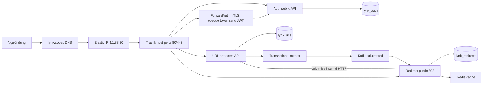
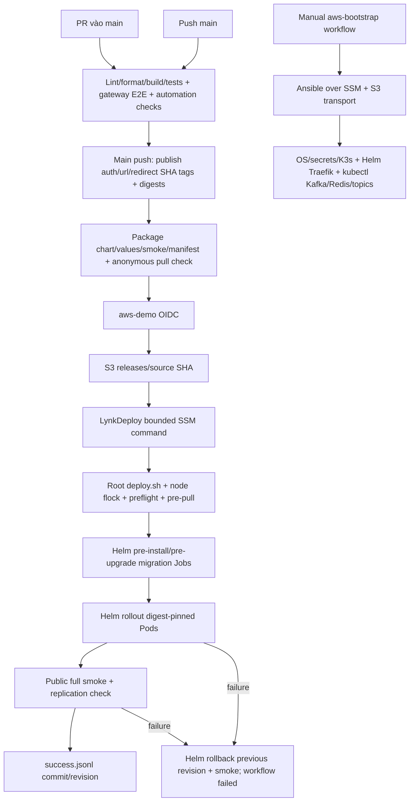

# CP01 — Baseline và quyền sở hữu deployment

CP01 chỉ đọc runtime và thêm tài liệu. Không apply CloudFormation, Ansible, Helm hay GitOps; không resize, rotate secrets, migration hoặc thay dữ liệu. Quay lại bằng `git revert <commit-CP01>`; không cần rollback AWS. Chỉ bắt đầu CP02 khi người học nói **“tiếp”**.

## Nguồn và thời điểm

Đọc source ở `eaea0c9eed18674d538e61cba160c5a44562377f`, branch gốc `fix/github-oidc-subject`; local `origin/main` ở `b6cc75a477df508eadda3b0f57d9a9994b304a11`. PR #2 vẫn mở tại thời điểm kiểm tra. Baseline không có nghĩa branch này đã được merge.

AWS API và public HTTPS được đọc ngày 2026-10-09 UTC (2026-10-10 tại Asia/Bangkok). Snapshot SSM bắt đầu `2026-10-09T22:18:12Z`; xem [bằng chứng runtime](evidence/cp01-runtime.json). Thời gian ghi release trên node là `2026-10-08T20:39:41.778983+00:00`; giữ nguyên timestamp quan sát được, không suy ra từ ngày ghi runbook cũ.

Nguồn đã đọc: ba workflow trong `.github/workflows/`, `infra/aws/{stack,automation,kafka,redis,traefik-values}.yaml`, `infra/ansible/{bootstrap,inventory}.yml`, chart `infra/k8s/helm/lynk-services`, `gitops/*.yaml`, scripts bootstrap/CD và hai runbook AWS hiện có. Baseline này phân biệt lịch sử trong runbook với runtime hôm nay.

## Quyền sở hữu hiện tại và đích

| Phạm vi                                                  | Hiện tại                                        | Đích sau các checkpoint                  |
| -------------------------------------------------------- | ----------------------------------------------- | ---------------------------------------- |
| AWS network, EC2/EBS/EIP, IAM node, S3                   | CloudFormation `lynk-k3s-dev`                   | Terraform                                |
| GitHub OIDC, IAM delivery/bootstrap, SSM document/policy | CloudFormation `lynk-cicd`                      | Terraform                                |
| OS, K3s, Helm, secrets và nền tảng                       | User data + Ansible bootstrap + platform script | Ansible chỉ bootstrap/secrets/controller |
| Traefik                                                  | Helm từ platform script                         | ArgoCD                                   |
| Kafka/Redis/topics                                       | kubectl từ platform script                      | ArgoCD                                   |
| auth/url/redirect và migration Jobs                      | GitHub Actions → SSM → Helm                     | ArgoCD; Actions publish/promote/verify   |
| DNS `lynk.codes`                                         | Name.com theo runbook cũ                        | Giữ nguyên; không chuyển DNS ở CP01      |
| PostgreSQL                                               | Neon theo runbook/provisioning source           | Giữ nguyên database, roles và dữ liệu    |

Chưa có namespace `argocd` hoặc `lynk-staging` trong cluster AWS. Hai Application hiện có dùng `HEAD`/auto-sync/prune và trỏ `lynk-staging`; chúng không phải release AWS đang chạy. Không apply chúng để “chuẩn hóa” baseline.

Charter mô tả analytics và Redis 7, nhưng deployment thực tế có **auth/url/redirect**, Redis **8-alpine**, Kafka **4.2.2** KRaft. Analytics chưa được triển khai trong chart/workflow đang đọc. CP01 ghi nhận khác biệt, không thêm service hay đổi phiên bản.

## Inventory AWS đã đối chiếu API

Account `231136241975`, region `ap-southeast-1`, profile `ngqkhai-dev`. STS identity thuộc SSO AdministratorAccess; không ghi credentials.

| Logical resource           | ID/giá trị hiện tại                                                                            |
| -------------------------- | ---------------------------------------------------------------------------------------------- |
| Vpc                        | `vpc-09c4afddd4dfc6502`                                                                        |
| Subnet                     | `subnet-00400b58035a53c92`                                                                     |
| InternetGateway            | `igw-0bb523dabd532a6e9`                                                                        |
| GatewayAttachment          | `IGW\|vpc-09c4afddd4dfc6502` (physical ID CFN)                                                 |
| RouteTable / InternetRoute | `rtb-0a44522bc2a4690b5` / default route `0.0.0.0/0`                                            |
| RouteAssociation           | `rtbassoc-057406c3a2418d297`                                                                   |
| SecurityGroup              | `sg-0548386ccc4cb294f`                                                                         |
| Instance                   | `i-03bb7dcb94ec8bd21`, running, `t3.small`, credit mode `standard`                             |
| AMI                        | `ami-09fad7bb72d4e6685`                                                                        |
| Root EBS                   | `vol-09662942cb90152da`, 30 GiB gp3, encrypted, in-use; `/dev/sda1`, DeleteOnTermination=false |
| InstanceRole               | `lynk-k3s-dev-InstanceRole-kGsx9JYHkqVh`                                                       |
| InstanceProfile            | `lynk-k3s-dev-InstanceProfile-laelrId0FDdg`                                                    |
| ElasticIp                  | `3.1.88.80`; allocation `eipalloc-0f88a7eca6c3660d1`                                           |
| IpAssociation              | `eipassoc-0d9ab4bf56ed84463`                                                                   |
| Network interface          | `eni-06551b4cd2fbd6599`, private IP `10.70.1.221`                                              |
| ArtifactBucket             | `lynk-k3s-dev-artifactbucket-acumvnfx55sd`                                                     |
| GitHubProvider             | `arn:aws:iam::231136241975:oidc-provider/token.actions.githubusercontent.com`                  |
| DeployRole / BootstrapRole | `lynk-github-deploy` / `lynk-github-bootstrap`                                                 |
| DeployDocument             | `LynkDeploy`                                                                                   |
| NodeArtifactPolicy         | `lynk--NodeA-OpeJ8TbyjiAK` (physical ID CFN)                                                   |

Stack resources đều có trạng thái CREATE_COMPLETE/UPDATE_COMPLETE. EBS và ENI là tài nguyên sinh kèm EC2, không phải logical resources độc lập trong template. Mapping import CP05/06 phải xử lý điều này, không coi bảng trên là cấu hình Terraform sẵn dùng.

Theo source: VPC `10.70.0.0/16`, subnet `10.70.1.0/24`; ingress public 80/443; IMDSv2 required. Artifact bucket private/AES256; lifecycle `artifacts/` 7 ngày, `deploy-logs/` 14 ngày; không có expiry cho `releases/` trong template. Đây là thuộc tính source, chưa audit live bucket/network policies. Chưa có state backend Terraform trong source; CP04 sẽ tạo riêng.

Trust source dùng immutable prefix `repo:ngqkhai@92835482/lynk-url-shortener@1365808803` với environment `aws-demo`/`aws-bootstrap`. Deploy role được gọi `LynkDeploy`; bootstrap role có SSM session và S3 transport. CP01 không sửa trust hoặc environment gate.

## Kubernetes, Helm và dữ liệu local

Node `ip-10-70-1-221`: Ready, Ubuntu 24.04.5 LTS, K3s `v1.37.1+k3s1`, containerd `2.3.4-k3s1`, Helm `v3.21.2`; K3s active, NRestarts=0 tại snapshot (không phủ nhận sự cố lịch sử).

Namespaces: `default`, `kube-node-lease`, `kube-public`, `kube-system`, `lynk-aws`, `traefik`.

| Helm release    | Namespace   | Revision | Chart / app                      | Status   |
| --------------- | ----------- | -------- | -------------------------------- | -------- |
| lynk-services   | lynk-aws    | 6        | lynk-services-0.2.0 / 0.2.0      | deployed |
| traefik         | traefik     | 4        | traefik-41.5.0 / v3.7.13         | deployed |
| gateway-api-crd | kube-system | 1        | gateway-api-crd-1.6.103 / v1.6.1 | deployed |

| PVC                   | PV                                       | Capacity | Class / reclaim     |
| --------------------- | ---------------------------------------- | -------- | ------------------- |
| lynk-aws/data-kafka-0 | pvc-3d265835-77fe-4c44-ba7f-2a3fae7d16cb | 5 Gi     | local-path / Delete |
| traefik/traefik       | pvc-d44a3678-d5a7-4a96-a9e4-5745ebf9b0ab | 1 Gi     | local-path / Delete |

Cả hai Bound, RWO, dữ liệu nằm trên node. Kafka giữ log/read-model events; Traefik lưu `/data/acme.json`. Không xóa PVC/namespace hoặc dùng `helm uninstall` trong adoption. Redis không persistence, cache có thể tái tạo.

| Pod phục vụ                       | Ready / status | Restarts |
| --------------------------------- | -------------- | -------- |
| auth-service-8474c59dd-l45cp      | 1/1 Running    | 0        |
| url-service-69fc4b99b6-bw8vn      | 1/1 Running    | 0        |
| redirect-service-68cb8774d4-5z28z | 1/1 Running    | 1        |
| kafka-0                           | 1/1 Running    | 1        |
| lynk-redis-5fc4c9cfcc-m8vx2       | 1/1 Running    | 1        |
| traefik-bf9974664-ndq8t           | 1/1 Running    | 0        |

CoreDNS/metrics-server/local-path-provisioner cũng Ready; restarts lần lượt 4/4/1. Kafka topics và gateway CRD install Pods Completed. Không có migration Pods trong snapshot này; không diễn giải sự vắng mặt thành migration failure hoặc success mới.

Số đo điểm thời gian: CPU **130m (6%)**, RAM **1489 MiB (78%)**; root filesystem 29G, dùng 6.0G, trống 23G (22% used). Không phải benchmark/headroom gate để cài ArgoCD.

## Release và image đang chạy

`/opt/lynk/releases/success.jsonl` ghi commit `b6cc75a477df508eadda3b0f57d9a9994b304a11`, revision 6. Deployment image refs khớp Pod imageIDs:

| Image                                 | Digest                                                                  |
| ------------------------------------- | ----------------------------------------------------------------------- |
| ghcr.io/ngqkhai/lynk-auth-service     | sha256:f4e2964249d4c3679807ae5d315b34831e0bbdf7970119da830b74f42f8fd65c |
| ghcr.io/ngqkhai/lynk-url-service      | sha256:1d916376cf6afce9c98e6a4517e2dfb2356b285c1cd2d02c62e55a487e70c978 |
| ghcr.io/ngqkhai/lynk-redirect-service | sha256:8bec2f41a7431722f156d6447bd13c9dfe5d54fedd771566b531661d1ee11e82 |
| apache/kafka:4.2.2                    | sha256:1213eb3943d551e5ed1fca7a4e109001cee35770b66a02a0c37a8964efe09b69 |
| redis:8-alpine                        | sha256:3811787313eba226a2ef38658c6ccb91cd5e110edc89c37767de373120a0e5a0 |
| traefik                               | sha256:24841fe2de7304c149343d877d2923b4c8800a38ba015dea9174c23b20e344a0 |

GitHub main run [37839590947](https://github.com/ngqkhai/lynk-url-shortener/actions/runs/37839590947) cho commit b6cc75a success. Các run gần nhất 37841343685 (eaea0c9), 37840812025 (50be8f1) success; trạng thái CI success không chứng minh các commit branch đã deploy. Node release ledger là bằng chứng deployment riêng.

## Secrets references và dữ liệu cần giữ

Chỉ lấy tên và tên keys, không lấy values/connection strings:

| Secret trong lynk-aws | Keys                            | Dùng cho                       |
| --------------------- | ------------------------------- | ------------------------------ |
| auth-service-db       | DATABASE_URL                    | auth và auth migration         |
| url-service-db        | DATABASE_URL                    | URL và URL migration           |
| redirect-service-db   | DATABASE_URL                    | redirect và redirect migration |
| lynk-redis-auth       | redis-password                  | Redis / redirect               |
| lynk-jwt-keys         | jwt-private.pem, jwt-public.pem | auth ký / URL xác minh         |
| lynk-gateway-ca       | ca.crt                          | Traefik xác minh gateway       |
| lynk-gateway-server   | ca.crt, server.crt, server.key  | auth mTLS server               |
| lynk-gateway-client   | tls.crt, tls.key                | Traefik mTLS client            |

Helm release Secrets v1–v6 có key `release`; không xuất nội dung. Runtime source files ở `/opt/lynk/secrets`: `auth.env`, `url.env`, `redirect.env`, `redis-password`, JWT pair, `ca.crt`, server/client cert/key; Ansible khai báo directory 0700/files 0600 và không overwrite (`force: false`). Chưa xác minh live permissions hoặc phục hồi; đó là CP03/09. Theo runbook cũ CA signing key đã bị xóa, không được coi CA certificate là signing key.

Neon project/branch theo runbook: `restless-water-85518233` / `production`; chưa truy vấn live Neon ở CP01. Provisioning source xác định ownership `lynk_urls`→`lynk_url`, `lynk_redirects`→`lynk_redirect`, `lynk_auth`→`lynk_auth`. Không truy vấn chéo DB; không đổi API.

**Cần giữ:** databases/roles/dữ liệu, EBS, Kafka PVC/logs, Traefik PVC/ACME, domain/EIP, JWT/mTLS keys, runtime env files, known-good release/digests, Helm history và mapping tài nguyên. **Có thể tái tạo từ nguồn đầy đủ:** Pods, Deployments/Services, Redis cache, controller/tool binaries, rendered manifests. EC2 có thể tái tạo về cấu hình, nhưng ổ chứa dữ liệu/secrets hiện tại chưa có restore được chứng minh; không coi node là disposable.

## Hai luồng đang hoạt động



Chart route `/health` đi URL-service; `/api/v1/auth` đi auth; `/api/v1/urls` qua phantom-token middleware; `/` đi redirect. Redirect không truy vấn `lynk_urls`.



Bootstrap và deploy dùng chung Actions concurrency `lynk-aws-deployment`, cancel-in-progress=false; node có lock riêng. CI hiện chưa có path filters/deployment mode paused. CP01 push branch/PR không kích hoạt main deployment; không merge. CP02 mới freeze delivery. Helm migration mode AWS hiện là `helm`, dù templates đã hỗ trợ Argo PreSync; controller adoption chưa diễn ra.

## Kiểm chứng và nơi tìm lỗi

Public CP01 dùng TLS verification, không tạo accounts/URLs: `/health/ready` trả 200 với database `ok`. Full `scripts/smoke-sprint3a.py` có ghi dữ liệu tổng hợp, nên không chạy trong baseline chỉ đọc. Full smoke pass của release revision 6 là bằng chứng lịch sử trong `aws-cicd.md`, không phải lần đo mới của CP01.

Public liveness `/health` trả 200 (`status=ok`, `service=url-service`); truy cập `/api/v1/urls/cp01missing` không có token trả 401. Đây là kiểm tra liveness/readiness và authentication boundary, chưa kiểm chứng lại redirect hoặc đăng nhập/mTLS end-to-end.

Các lệnh inventory đã dùng (profile/region explicit; không xuất credentials):

```bash
aws --profile ngqkhai-dev --region ap-southeast-1 sts get-caller-identity
aws --profile ngqkhai-dev --region ap-southeast-1 cloudformation list-stack-resources --stack-name lynk-k3s-dev
aws --profile ngqkhai-dev --region ap-southeast-1 cloudformation list-stack-resources --stack-name lynk-cicd
aws --profile ngqkhai-dev --region ap-southeast-1 ec2 describe-instances --instance-ids i-03bb7dcb94ec8bd21
aws --profile ngqkhai-dev --region ap-southeast-1 ec2 describe-instance-credit-specifications --instance-ids i-03bb7dcb94ec8bd21
aws --profile ngqkhai-dev --region ap-southeast-1 ec2 describe-addresses --public-ips 3.1.88.80
aws --profile ngqkhai-dev --region ap-southeast-1 ec2 describe-volumes --volume-ids vol-09662942cb90152da
gh run list --limit 5 --json databaseId,headSha,status,conclusion,workflowName
gh pr list --json number,title,headRefName,url
```

SSM command `917ce705-f117-4309-85f3-c11cb96a3dcc` (`AWS-RunShellScript`) hoàn tất Success/exit 0. Chỉ đọc K3s/Helm versions, service state, node/namespace/Pod/PV/PVC metadata, image refs/IDs, secret names/key names, release ledger, node metrics và disk usage. Không chạy bootstrap/deploy entrypoint. Bằng chứng JSON lưu stdout/stderr đã kiểm tra, không lưu Secret data.

| Bước lỗi               | Bằng chứng cần đọc                                                             |
| ---------------------- | ------------------------------------------------------------------------------ |
| CI/build/publish       | GitHub run/job logs, uploaded image metadata/release artifact                  |
| OIDC                   | configure-aws-credentials job, immutable subject và IAM trust                  |
| S3/SSM transport       | command ID / GetCommandInvocation; private deploy-logs prefix                  |
| Bootstrap/K3s          | Ansible task/handler; `journalctl -u k3s`; cloud-init logs trên node           |
| Migration/rollout      | Helm history/status; `kubectl get jobs,pods`, events, migration/container logs |
| HTTPS/auth/mTLS        | Traefik và auth logs; cert metadata, URL/redirect logs                         |
| Kafka/read-model/cache | Kafka/redirect/URL outbox logs; chỉ dùng quyền DB của từng service             |

Không dump environment, Secrets YAML, Helm release Secret content hoặc đầy đủ DB URLs vào logs. SSM snapshot chỉ xuất metadata và secret key names; raw Kubernetes Secret payload không được lưu ra file.

## Bài học và bàn giao

Kiểm tra local CP01: `npm run lint` exit 0; `npm run test` exit 0 (integration mặc định skipped); sau đó `RUN_INTEGRATION_TESTS=true npm run test` exit 0, **42/42 tests pass**, không skipped (auth 5, redirect 17, URL 16, shared 4). PostgreSQL/Redis test containers chạy local, không dùng production credentials. `python3 scripts/cd/test-deploy.py`: **7/7 pass**, transport giả lập. Prettier cho bốn file thay đổi, `git diff --check`, link tài liệu và JSON evidence đều pass.

Pre-flight: không sửa mã ứng dụng/kiến trúc phân tầng; local TypeScript imports trong service source đều `.js`; service layer không có `FastifyRequest`, `FastifyReply` hoặc `console.log`; ba service Dockerfiles có `USER node`. HTTP liveness/readiness public pass như trên. Baseline/evidence không chứa private key, PostgreSQL URI, AWS access key, GitHub token hoặc opaque-token values qua kiểm tra pattern và review nội dung. Đây là kiểm tra nội dung CP01, không phải audit toàn bộ lịch sử Git/secrets.

**Resource** là tài nguyên có định danh (EC2, PVC, IAM role). **Desired state** là cấu hình mong muốn trong template/chart/values. **Runtime state** là trạng thái API và container thật đang chạy. Source branch mới, CI success, Helm revision và digest runtime là các bằng chứng khác nhau: phải đối chiếu trước khi kết luận deploy thành công.

Bài tập: đánh dấu thành phần bị gián đoạn nếu EC2 dừng; phân biệt dữ liệu còn trên EBS/Neon với dịch vụ không phục vụ request. Câu hỏi kiểm tra: vì sao giữ database Neon và Elastic IP chưa đủ để URL vẫn redirect khi node dừng?

Chưa thực hiện CP02–CP18. Các phiên bản Terraform/provider/ArgoCD trong kế hoạch là mục tiêu sau này, chưa cài hoặc xác minh ở CP01.
